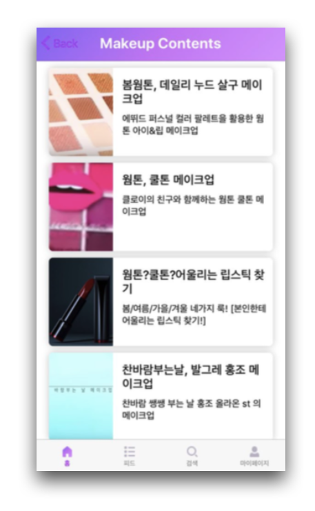

# ItTone

### Software Maestro 8기에서 진행한 itTone 프로젝트 어플입니다.

#### 자신에게 가장 어울리는 색상(퍼스널컬러)의 화장품을 💄 사용할 수 있도록 추천해주는 어플리케이션입니다.

(해당 어플은 회원가입, 로그인, Camera와 분석 결과는 Native로 화장품 추천과 피드등 다양한 기능은 웹으로 제작되었습니다)

  

---

### 퍼스널컬러 화장품 추천 방식

**ItTone**은 사용자의 피부색과 가장 어울리는 화장품을 추천해줍니다.

  

**ItTone**은 사용자의 피부색을 어플 카메라를📷 통해 분석합니다.

이 때, **White Balancing** 문제 해결을 위해 자체 제작한 스킨톤지를 얼굴과 함께 촬영합니다.

---

### 그 외의 다양한 컨텐츠

**ItTone**은 아래와 같이 6가지의 다양한 기능을 제공합니다.

- 피부색 측정 기능
- 피부색에 어울리는 화장품 추천 기능
- 사용자 소통을 위한 피드 기능
- 날씨 기반 데일리 코멘트 기능
- 화장품 유통기한 알림 기능
- 전문가 뷰티 콘텐츠 기능

### 서비스 화면

  
  

  
  

  
  
  

